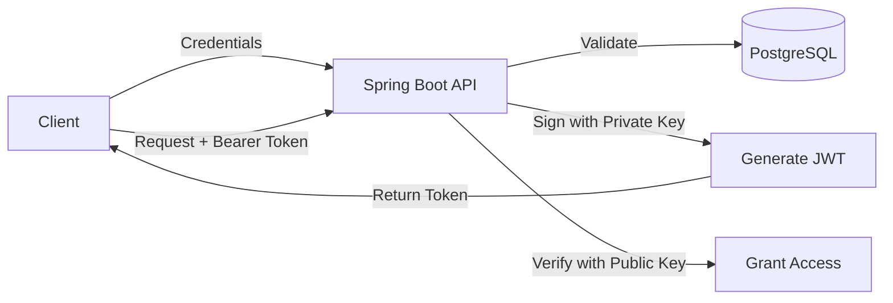

# 🔐 Spring Security JWT with Asymmetric Encryption (RSA)


A production-ready implementation of **Asymmetric Encryption (RSA)** for JWT Authentication using Spring Boot 3. This project demonstrates how to sign tokens with a Private Key and verify them with a Public Key, deployed on **Oracle Cloud VPS** via a fully automated **CI/CD pipeline**.

Live site: http://enescelebi.duckdns.org:8080/


---

## 🚀 Features

- **Asymmetric Encryption:** Uses RSA (2048-bit) key pairs.
    - **Private Key:** Used to sign the JWT (Authentication).
    - **Public Key:** Used to verify the JWT (Authorization).
- **Security Best Practices:**
    - Keys are managed outside the application artifact (JAR).
    - Docker Volumes are used to inject keys securely at runtime.
    - `.pem` files are strictly excluded from the repository.
- **Architecture:**
    - **Backend:** Spring Boot 3, Spring Security 6.
    - **Database:** PostgreSQL (Dockerized).
    - **Documentation:** OpenAPI (Swagger UI).
- **DevOps & Deployment:**
    - **Docker Compose:** Orchestrates the App and Database services.
    - **CI/CD:** GitHub Actions automates building, testing, and deploying to Oracle Cloud.
    - **Environment:** Runs on an Oracle Cloud Compute Instance (Ubuntu).

---

## 🏗️ Architecture & Workflow

1.  **Login:** User sends credentials. Server validates against DB.
2.  **Sign:** Server uses the **Private Key** (stored securely on the server) to generate a signed JWT.
3.  **Verify:** For subsequent requests, the server uses the **Public Key** to verify the token signature.



---

## 🛠️ Tech Stack

* **Language:** Java 17
* **Framework:** Spring Boot 3.4.0
* **Security:** Spring Security, Java Security (RSA)
* **Database:** PostgreSQL
* **Containerization:** Docker & Docker Compose
* **CI/CD:** GitHub Actions
* **Cloud Provider:** Oracle Cloud Infrastructure (OCI)

---

## ⚙️ Getting Started (Local Development)

### Prerequisites
* Java 17+
* Docker & Docker Compose
* Maven

### 1. Clone the Repository
```bash
git clone [https://github.com/enescelebii/Spring-Security-JWT-Asymmetric-Encryption.git](https://github.com/enescelebii/Spring-Security-JWT-Asymmetric-Encryption.git)
cd Spring-Security-JWT-Asymmetric-Encryption
```

### 2. Generate RSA Keys
Since keys are not stored in the repo for security, you must generate them:

```bash
# Create directory
mkdir -p keys/local-only
cd keys/local-only

# Generate Private Key
openssl genrsa -out private_key.pem 2048

# Generate Public Key
openssl rsa -in private_key.pem -pubout -out public_key.pem

# Go back to root
cd ../..
```

### 3. Run with Docker Compose
```bash
docker-compose -f docker-compose.dev.yml up -d --build
```

The application will start at `http://localhost:8080`.

---

## 🐳 Deployment Strategy (CI/CD)

This project uses a robust deployment strategy ensuring **Zero-Trust** for sensitive keys in the codebase.

1.  **Code Push:** Developer pushes code to GitHub (Keys are `.gitignore`'d).
2.  **GitHub Actions:**
    * Sets up Java environment.
    * Builds the JAR file.
    * Builds the Docker Image.
    * Pushes the image to Docker Hub.
    * Connects to **Oracle Cloud VPS** via SSH.
    * Pulls the new image and restarts containers.
3.  **Runtime Security:**
    * The **Private Key** resides *only* on the VPS file system (`/opt/task-flows-app/keys`).
    * Docker mounts this directory into the container at runtime using **Volumes**.

```yaml
# Snippet from docker-compose.dev.yml
services:
  app:
    volumes:
      - ./keys:/app/keys  # Injecting keys from Host to Container
```

---

## 📄 API Documentation

Swagger UI is available for testing endpoints interactively.

* **Local URL:** [http://localhost:8080/swagger-ui/index.html](http://localhost:8080/swagger-ui/index.html)
* **Live Demo (Oracle Cloud):** [http://129.159.220.126:8080/swagger-ui/index.html](http://129.159.220.126:8080/swagger-ui/index.html)

---

## 👤 Author

**Enes Celebi**

* LinkedIn: [Enes Celebi](https://www.linkedin.com/in/enes-celebi/)
* GitHub: [@enescelebii](https://github.com/enescelebii)

---
